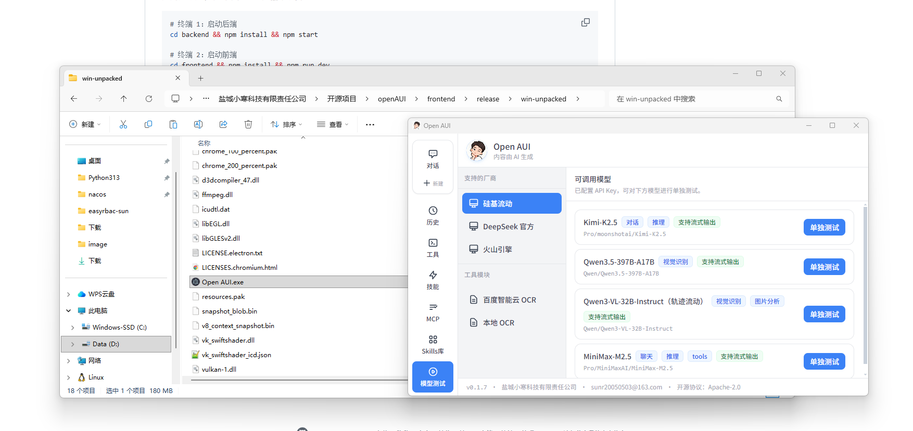

# Open AUI

[](https://github.com/sunG91/OpenAUI)
[](https://github.com/sunG91/OpenAUI)
[](https://github.com/sunG91/OpenAUI)
[](https://github.com/sunG91/OpenAUI)
[](https://github.com/sunG91/OpenAUI)
[](https://github.com/sunG91/OpenAUI)
[](https://github.com/sunG91/OpenAUI)

> 让 AI 真正「动手」操作电脑的开源智能助手框架

## 简介

Open AUI（Open AI User Interface）是一款开源多模态 AI 操作框架，支持：
- 语音交互（含唤醒）
- 控制台命令执行
- 浏览器网页自动化
- 任务拆分与多模型调度
- 行为记忆与会话整理
- Chat / AUI 双模式

### 界面预览（v0.1.9）


## 环境要求

| 项目 | 要求 |
|------|------|
| **Node.js** | 22.x 或更高（推荐 22 LTS） |
| **npm** | 9.x 或更高（随 Node 安装） |
| **操作系统** | Windows 10/11（64 位） |
| **磁盘空间** | 约 500MB（含依赖与打包产物） |

> 开发模式需安装 Node.js；打包后的 exe 可独立运行，无需用户安装 Node。

## 文档

- [产品设计文档](./docs/open-aui-产品设计文档.md) —— 功能、交互与架构说明（含天枢架构图，待开发，欢迎学习讨论）
- [English README](./README.en.md) —— Brief English overview for GitHub

## 快速开始

### 一键安装所有依赖（推荐）

在项目根目录执行，可一次性安装前端、后端、Playwright、Python 可选依赖及视觉模型：

```bash
npm run install-all
```

或直接运行：

```bash
node scripts/install-all.js
```

| 选项 | 说明 |
|------|------|
| `--skip-playwright` | 跳过 Playwright Chromium |
| `--skip-python` | 跳过 Python 依赖（vosk/ultralytics） |
| `--skip-vision` | 跳过视觉模型下载 |
| `--skip-embeddings` | 跳过 Embeddings 模型预下载 |
| `--vision-only` | 仅下载视觉模型 |
| `--help` | 显示帮助 |

支持 Windows / Linux / macOS。

> **说明**：记忆存储使用 Vectra（Node.js 原生，无 Python 依赖）；ultralytics（视觉模型转换）需 Python。

### 方式一：Electron 窗口应用（推荐）

双击 **`启动 Open AUI.bat`** 一键启动；或手动：

```bash
cd frontend
npm install
npm run electron:dev
```

会打开独立桌面窗口，体验类似 QQ、VS Code。WebSocket 内置在应用内，无需单独启动后端。

### 方式二：浏览器开发模式

分别启动后端和前端，在浏览器中访问：

```bash
# 终端 1：启动后端
cd backend && npm install && npm start

# 终端 2：启动前端
cd frontend && npm install && npm run dev
```

浏览器访问 http://localhost:5173

### 打包为可执行程序

```bash
cd frontend
npm install
npm run electron:build  # 构建并生成 release/win-unpacked/Open AUI.exe
```

打包完成后，在 `frontend/release/win-unpacked/` 目录下运行 **Open AUI.exe** 即可，前后端已合并，无需单独安装 Node.js。



- **图标**：将 `icon256.ico`（至少 256×256）放入 `public/images/icon/`，打包时自动嵌入 exe
- **AI 头像**：将 `ai.png` 放入 `public/images/头像/`，用于界面左侧头像

> 说明：当前后端为回显模式，发送内容会原样返回，后续将接入 AI 模型。
>
> **开发状态**：作者目前主要精力在兼容 AI 工具（GUI、浏览器、MCP 等），聊天模块、历史记录等暂未完整开发。
>
> **常见问题**：
> - 前端报错 `@rollup/rollup-win32-x64-msvc`：在 frontend 目录执行 `npm install @rollup/rollup-win32-x64-msvc`
> - Electron 报错 EBUSY：**完全退出 Cursor/VS Code**，在资源管理器中双击 **`安装依赖.bat`**（勿在 Cursor 终端运行）。若仍失败，可将项目移动到 `C:\openAUI` 等纯英文路径再试

---

© 盐城小寒科技有限责任公司
