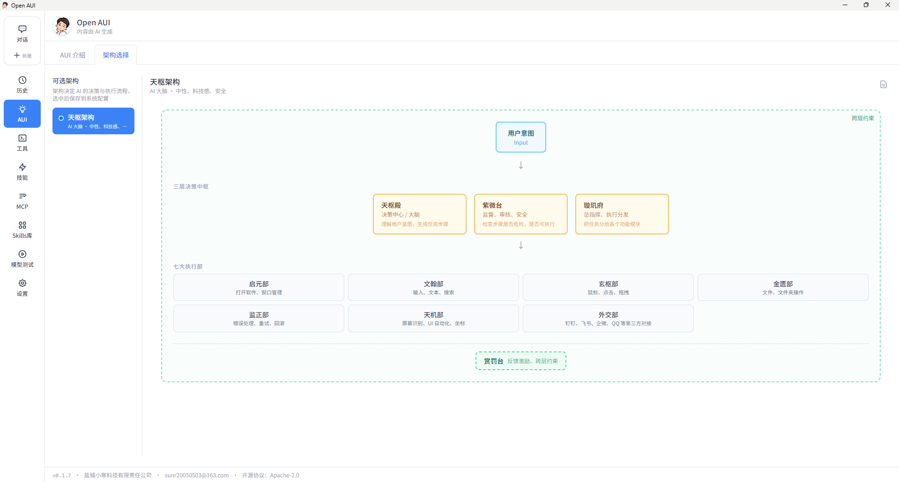
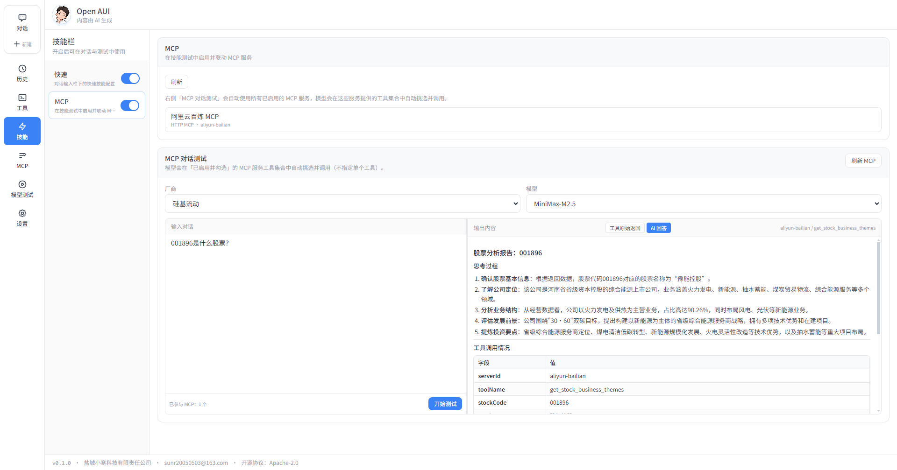
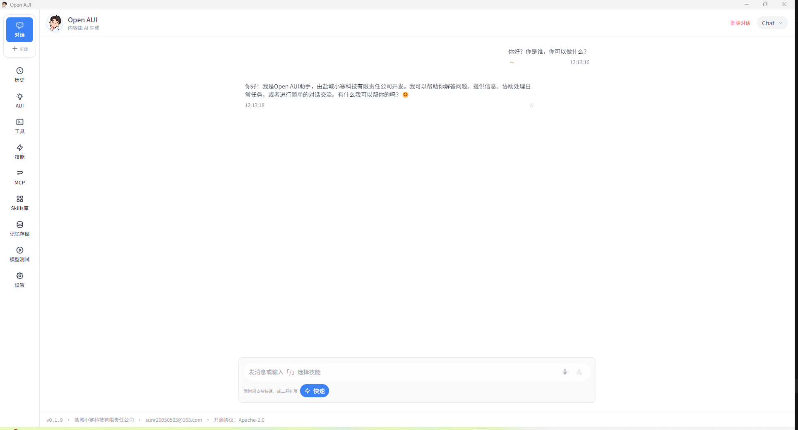
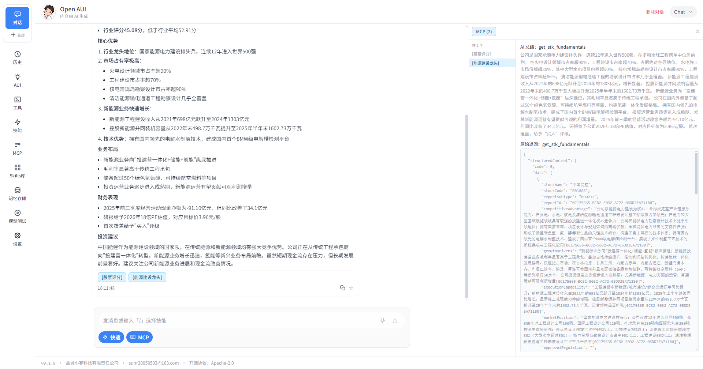
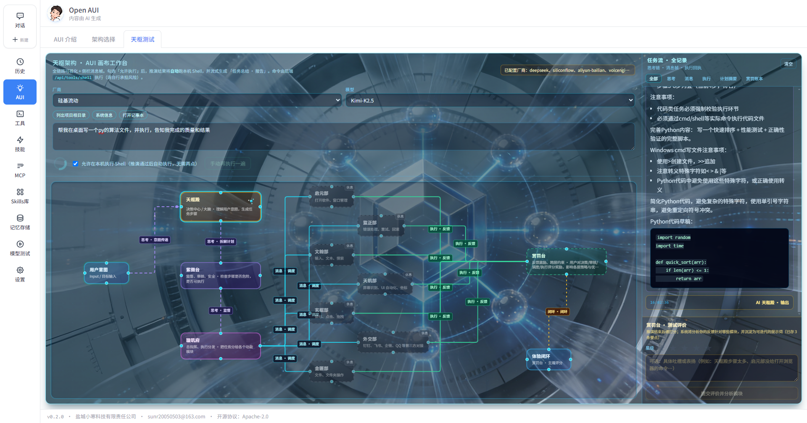

# Open AUI

> 一款让 AI 真正「动手」操作电脑的开源智能助手框架

---

## 一、产品概述

**Open AUI**（Open AI User Interface）是一个开源的多模态 AI 操作框架，旨在让用户通过自然语言与 AI 对话，AI 能够理解用户意图并直接操作用户的电脑（控制台、浏览器、应用等），实现「说即所得」「对话即操作」的体验。

核心设计理念：
- **用户体验优先**：交互流畅、反馈及时、界面直观
- **部署零门槛**：不依赖 Docker，Electron 单安装包即可运行
- **可用性高**：界面简洁、交互清晰、能力可扩展
- **双模式**：支持普通对话（Chat）与 AI 操作模式（AUI）

**开发状态说明**：作者目前主要精力在兼容 AI 工具（GUI、浏览器、MCP、WinUI 定位等），聊天模块、历史记录等暂未完整开发。

### 基础版下载（免本地编译配置）

若用户觉得从源码安装依赖、自行打包配置较为麻烦，可直接下载预构建的 **release.zip**（基础版）：解压后运行 **Open AUI.exe** 即可体验，也可在此基础上二次开发。

| 方式 | 说明 |
|------|------|
| **夸克网盘** | [https://pan.quark.cn/s/9fbfe0343090](https://pan.quark.cn/s/9fbfe0343090)（分享内容：`release.zip`） |
| **夸克 APP** | 复制口令 `/~7ab33M8om1~/`，打开夸克 APP 即可获取同一分享 |

> 基础版仍需在应用内配置各厂商 API Key 等；二次开发请遵守项目开源许可证。

---

## 二、功能模块设计

### 2.1 语音模块

| 能力 | 描述 |
|------|------|
| 实时监听 | 持续监听用户麦克风输入，实时转写与识别 |
| 唤醒功能 | 支持自定义唤醒词（如「小寒」「open aui」）进入待命状态 |
| 免输入操作 | 用户完全通过语音下达指令，无需键盘输入 |
| 语音反馈 | 支持 TTS 播报执行结果或对话内容 |

**技术要点**：ASR（语音识别） + 唤醒词检测 + TTS（语音合成）

---

### 2.2 控制台模块

| 能力 | 描述 |
|------|------|
| 命令执行 | 在用户电脑终端/命令行中执行各类命令 |
| 跨平台 | 支持 Windows（PowerShell/CMD）、macOS、Linux |
| 安全控制 | 支持沙箱、权限校验、危险命令二次确认 |
| 输出捕获 | 捕获命令输出并反馈给用户 |

**技术要点**：Node.js `child_process`（spawn/exec）、Shell 适配（PowerShell/CMD/bash）、输出流捕获

---

### 2.3 浏览器网页操作模块

| 能力 | 描述 |
|------|------|
| DOM 解析 | 解析页面按钮、输入框、链接等可交互元素 |
| 脚本操作 | 通过注入脚本或自动化协议（如 CDP）进行点击、输入、滚动等 |
| 多模态识别 | 结合视觉（截图/OCR）和结构分析，识别复杂 UI 元素 |
| 多标签页 | 支持多窗口/多标签页的识别与切换 |

**技术要点**：Electron BrowserWindow、CDP（Chrome DevTools Protocol）、视觉模型（可选）

---

### 2.4 任务拆分模块

| 能力 | 描述 |
|------|------|
| 意图理解 | 将用户自然语言拆解为可执行的行为序列 |
| 模块调度 | 根据子任务类型调用对应模块（控制台、浏览器、扩展等） |
| 模型调度 | 不同子任务可调用不同模型（拆分模型、执行模型、对话模型等） |
| 串行/并行 | 支持任务串行执行与条件分支 |

**示例**：「打开浏览器搜索天气并告诉我」  
→ 拆分为：① 打开浏览器 ② 访问搜索引擎 ③ 输入「天气」 ④ 解析结果 ⑤ 生成回复

---

### 2.5 记忆模块

| 能力 | 描述 |
|------|------|
| 行为记录 | 每次执行任务时记录：指令、执行动作、结果、时间戳 |
| 上下文管理 | 支持多轮对话的上下文拼接与摘要 |
| 持久化 | 记忆可持久化存储，支持会话恢复 |
| 质量保障 | 通过历史行为优化回复准确性与操作成功率 |

**技术要点**：向量/关系型存储、摘要模型、上下文窗口管理

---

### 2.6 模型切换模块（模型组）

| 概念 | 描述 |
|------|------|
| 模型组 | 同一厂商下的一组模型，用于不同角色 |
| 拆分模型 | 负责任务拆分、意图理解 |
| 对话模型 | 负责生成自然语言回复、决策 |
| 语音模型 | 负责 ASR/TTS（可与第三方服务集成） |
| 视觉模型 | 可选，用于网页/屏幕多模态理解 |

**示例模型组**：
- 厂商 A：拆分（GPT-4）、对话（GPT-4）、语音（Whisper + TTS）
- 厂商 B：拆分（Claude）、对话（Claude）、语音（自研）

#### 用户配置：开箱即用

对用户而言，配置模型只需两步：

1. **选择模型组**：从系统提供的预置模型组中任选一个（如 OpenAI、Claude、豆包、通义等）
2. **填写 API Key**：根据所选模型组对应的厂商，填写该厂商的 API Key

配置完成后即可直接使用，无需额外设置。

**1 厂商 1 填写**：每个厂商对应一个 API Key 输入项，用户只需在对应厂商的 Key 输入框中填写一次，该厂商下的拆分、对话、语音等模型均共用此 Key。

#### 高级配置：按模块指定厂商

除上述「模型组」用法外，支持针对不同模块单独指定厂商与模型：

| 配置项 | 说明 |
|--------|------|
| 拆分模型 | 可单独选择厂商 A 的某模型 |
| 对话模型 | 可单独选择厂商 B 的某模型 |
| 语音模型 | 可单独选择厂商 C 的某模型 |

每个厂商的 API Key 仍遵循 **1 厂商 1 填写**：同一厂商只需填写一次 Key，该厂商下被选用的所有模型共享此 Key。

---

### 2.7 扩展模块

| 能力 | 描述 |
|------|------|
| JS 脚本 | 用户通过 JavaScript 编写自定义能力 |
| Py 脚本 | 用户通过 Python 编写自定义能力 |
| 注册机制 | 扩展可注册为「能力」，供任务拆分模块调度 |
| 安全沙箱 | 默认在沙箱中执行，避免影响系统 |

**示例**：自定义「发送邮件」「查询数据库」「调用内部 API」等。

---

### 2.8 对话模式：Chat / AUI

| 模式 | 描述 | 适用场景 |
|------|------|---------|
| **Chat** | 纯对话模式，仅文本问答 | 知识问答、闲聊、代码解释等 |
| **AUI** | AI 操作模式，可执行控制台、浏览器、扩展等 | 自动化操作、电脑控制、流程执行 |

用户可在界面上一键切换两种模式。

---

### 2.9 文档模块

| 能力 | 描述 |
|------|------|
| Markdown 格式 | 对话回复统一使用 MD 格式展示（标题、列表、代码块等） |
| 交互增强 | 支持表格、链接、图片的渲染与交互 |
| 会话整理 | 在 AUI 模式结束后，由 AI 对本次会话进行总结整理（Chat 模式不执行） |
| 可导出 | 支持将会话导出为 MD/PDF 等格式 |

---

## 三、AUI 架构（天枢）

> **状态（v0.2.1）**：天枢架构（三层决策 + 执行部画布 + 赏罚台测试流）**已实现**，可在 **AUI → 天枢测试** 中体验；当前处于**功能测试中**，持续优化提示词、执行稳定性与界面体验。下文架构图仍为概念示意，欢迎 Issue/PR 讨论。

天枢架构采用「三层决策中枢 + 七大执行部 + 机制」的设计，让 AI 真正「动手」操作电脑：

- **用户意图** → **三层决策中枢**（天枢殿、紫微台、璇玑府）→ **七大执行部**（启元部、文翰部、玄枢部、金匮部、监正部、天机部、外交部）
- **赏罚台**：跨层约束机制，由用户反馈驱动，可影响决策、审核、调度与执行

如有建议或想法，欢迎通过 Issue 或 PR 参与讨论。

---

## 四、界面设计

### 4.1 整体风格

- **主色调**：白色为主，模仿豆包（Doubao）的简洁清爽风格
- **布局**：以对话为中心的极简页面
- **字体**：清晰易读的无衬线字体

### 4.2 交互细节

| 元素 | 描述 |
|------|------|
| 音量波动 | 语音模式激活时，头像下方显示类似「打电话」的波形动画 |
| 模式切换 | Chat / AUI 一键切换，切换后界面状态与能力随之变化 |
| 普通对话模式 | 可关闭波形效果，呈现标准对话气泡样式 |

### 4.3 界面参考图（v0.1.0）

下图展示技能栏与 MCP 对话测试的界面布局：左侧为技能开关（快速、MCP）及 MCP 服务说明，右侧为 MCP 对话测试（厂商/模型选择、输入与输出、思考过程与工具调用情况）。

### 4.4 首页界面参考图（v0.1.9）

下图展示 Open AUI v0.1.9 的主界面：左侧为导航侧边栏（对话、历史、AUI、工具、技能、MCP、Skills 库、记忆存储、模型测试、设置等），中央为对话区域，底部为消息输入栏（支持语音、技能选择等）。

### 4.5 MCP 对接 Chat 参考图（v0.2.0）

下图展示 Open AUI v0.2.0 的 MCP 对接聊天界面：左侧为导航侧边栏，中央为对话区域（AI 回复下方固定 MCP 标签如 [股票评分]、[能源建设龙头]，可点击查看详情），右侧为 MCP 面板，展示工具列表、AI 总结与原始 JSON 返回。启用 MCP 后，模型可自动调用已配置工具，检索结果以精华摘要形式汇总后生成回答。

### 4.6 天枢架构测试工作台（v0.2.1）

下图展示 **Open AUI v0.2.1** 中「AUI 画布工作台 → 天枢测试」界面：含厂商/模型选择、天枢架构画布、任务流侧栏（含赏罚账本等），表明天枢架构**已落地**，当前为**测试与体验迭代**阶段。

---

## 五、技术选型

### 5.1 设计原则

- **用户体验优先**：交互流畅、反馈及时、界面直观
- **部署零门槛**：不依赖 Docker，单可执行文件即可运行
- **配置极简**：环境变量 + 单一配置文件（`config.yaml`）

### 5.2 部署形态

- **Electron 桌面应用**：打包为 Windows（exe）、macOS（dmg）、Linux 单安装包，自带 Chromium 与 Node，用户无需安装 Docker、浏览器等
- **单应用窗口**：独立桌面窗口，非浏览器标签页，体验类似 QQ、VS Code

### 5.3 技术栈

| 层级 | 技术 |
|------|------|
| 框架 | Electron |
| 前端 | React + Tailwind CSS |
| 后端 | Node.js（主进程） |
| 语音 | Web Speech API（渲染进程）+ 厂商 ASR/TTS |
| 控制台操作 | Node.js `child_process`（执行 Shell 命令） |
| 浏览器操作 | Electron BrowserWindow + CDP / executeJavaScript |
| 桌面/应用操作 | nut.js（键盘、鼠标模拟、屏幕识别）+ Electron `shell`（打开文件/应用） |
| 模型调用 | 统一抽象层，支持 OpenAI / Claude / 国产大模型 API |

### 5.4 模块解耦

各模块通过「能力注册 + 任务调度」解耦：
- 按需启用模块
- 独立扩展与替换
- 单元测试与集成测试

---

## 六、开发路线图

| 阶段 | 内容 |
|------|------|
| Phase 1 | 基础 Chat 对话 + 文档模块 + 简单白主题 UI |
| Phase 2 | 控制台模块 + 任务拆分模块 + 模型切换 |
| Phase 3 | 语音模块（含唤醒）+ AUI 模式 |
| Phase 4 | 浏览器操作模块 + 多模态 |
| Phase 5 | 记忆模块 + 扩展模块（JS/Py） |
| Phase 6 | 会话整理、导出、高级 UI 优化 |

---

## 七、文档更新记录

| 日期 | 版本 | 说明 |
|------|------|------|
| 2026-03-19 | v0.7 | 第三章天枢状态改为「已实现、测试中」；新增 4.6 天枢架构测试工作台参考图（v0.2.1） |
| 2026-03-19 | v0.6 | 新增 4.5 MCP 对接 Chat 参考图（v0.2.0），展示 MCP 工具调用、标签、右侧面板与原始返回 |
| 2026-03-19 | v0.5 | 新增 4.4 首页界面参考图（v0.1.9），展示主界面布局与侧边栏导航 |
| 2026-03-18 | v0.4 | 新增 AUI 架构（天枢）章节，含架构图 v0.0.1，标注待开发，欢迎学习讨论 |
| 2025-03-12 | v0.1 | 初稿，完成产品概述与模块设计 |
| 2025-03-12 | v0.2 | 补充模型组配置说明：选模型组 + API Key、1 厂商 1 填写、按模块指定厂商 |
| 2025-03-12 | v0.3 | 技术选型定为：Electron、React+Tailwind、Node.js、BrowserWindow，单安装包分发 |

---

> 本文档为 Open AUI 产品设计的初版说明，后续将随开发进度持续迭代。
